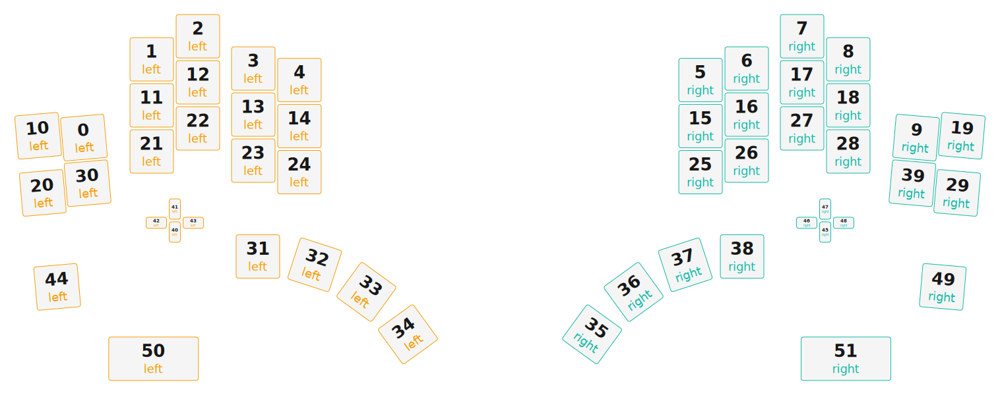

# ZMK Configuration for Splayt

*Generated by Shield Wizard for ZMK*



Download compiled firmware from the Actions tab. <https://zmk.dev/docs/user-setup#installing-the-firmware>

Edit your keymap <https://zmk.dev/docs/keymaps>.
User keymap is located at [`config/splayt.keymap`](config/splayt.keymap).

-----

<details>
<summary>
Shield Wizard Debug Information
</summary>

In case of broken configuration, here is the Shield Wizard internal data used to generate this configuration:

Commit: 8a52249f61161469b6d90ed8c80c4aa52b9f3858

```json
{"name":"Splayt","shield":"splayt","dongle":false,"modules":["badjeff/pmw3610"],"layout":[{"id":"01KJVNSZTJM1SB3Q9N8T4TC7RF","part":0,"row":0,"col":0,"w":1,"h":1,"x":0.99,"y":2.2,"r":-5,"rx":1.49,"ry":2.7},{"id":"01KJVNSZTJRVTZVFTSPKX9650Y","part":0,"row":0,"col":1,"w":1,"h":1,"x":2.46,"y":0.5,"r":0,"rx":0,"ry":0},{"id":"01KJVNSZTJNTJYWWW39WT79J5Q","part":0,"row":0,"col":2,"w":1,"h":1,"x":3.46,"y":0,"r":0,"rx":0,"ry":0},{"id":"01KJVNSZTJZEY94ZPRWBSQV9Q7","part":0,"row":0,"col":3,"w":1,"h":1,"x":4.66,"y":0.7,"r":0,"rx":0,"ry":0},{"id":"01KJVNSZTJB23BK4TPG74J3CED","part":0,"row":0,"col":4,"w":1,"h":1,"x":5.66,"y":0.95,"r":0,"rx":0,"ry":0},{"id":"01KJVNSZTJXXFJ3A6NQSCEX0SS","part":1,"row":0,"col":5,"w":1,"h":1,"x":14.35,"y":0.95,"r":0,"rx":0,"ry":0},{"id":"01KJVNSZTJ87TTWKQJ3BSPP9G7","part":1,"row":0,"col":6,"w":1,"h":1,"x":15.35,"y":0.7,"r":0,"rx":0,"ry":0},{"id":"01KJVNSZTJD52NRFZ2RV3R9TBM","part":1,"row":0,"col":7,"w":1,"h":1,"x":16.55,"y":0,"r":0,"rx":0,"ry":0},{"id":"01KJVNSZTJEYN37SFN38KHS3KJ","part":1,"row":0,"col":8,"w":1,"h":1,"x":17.55,"y":0.5,"r":0,"rx":0,"ry":0},{"id":"01KJVNSZTKJR0W7JPK23ZDRA0M","part":1,"row":0,"col":9,"w":1,"h":1,"x":19.02,"y":2.2,"r":5,"rx":19.52,"ry":2.7},{"id":"01KJVNSZTK5GGKQMC1E5K2C4F8","part":0,"row":1,"col":0,"w":1,"h":1,"x":0,"y":2.16,"r":-5,"rx":0.5,"ry":2.66},{"id":"01KJVNSZTKZ5W20BZN1ZC5ZK5R","part":0,"row":1,"col":1,"w":1,"h":1,"x":2.46,"y":1.5,"r":0,"rx":0,"ry":0},{"id":"01KJVNSZTKRNDVPNGNDE4NHT2P","part":0,"row":1,"col":2,"w":1,"h":1,"x":3.46,"y":1,"r":0,"rx":0,"ry":0},{"id":"01KJVNSZTK2MFCDYA3YBSB3PRG","part":0,"row":1,"col":3,"w":1,"h":1,"x":4.66,"y":1.7,"r":0,"rx":0,"ry":0},{"id":"01KJVNSZTK1FV37S6G8Z3NDWN9","part":0,"row":1,"col":4,"w":1,"h":1,"x":5.66,"y":1.95,"r":0,"rx":0,"ry":0},{"id":"01KJVNSZTKBW4Y7A8APJT2N775","part":1,"row":1,"col":5,"w":1,"h":1,"x":14.35,"y":1.95,"r":0,"rx":0,"ry":0},{"id":"01KJVNSZTKDV1C2EHG791M0YKS","part":1,"row":1,"col":6,"w":1,"h":1,"x":15.35,"y":1.7,"r":0,"rx":0,"ry":0},{"id":"01KJVNSZTK7VMFRFWZWGZTCVJ7","part":1,"row":1,"col":7,"w":1,"h":1,"x":16.55,"y":1,"r":0,"rx":0,"ry":0},{"id":"01KJVNSZTK4TB4C69V5WF5F6NH","part":1,"row":1,"col":8,"w":1,"h":1,"x":17.55,"y":1.5,"r":0,"rx":0,"ry":0},{"id":"01KJVNSZTKB8V4WM8A5QKDT0Q5","part":1,"row":1,"col":9,"w":1,"h":1,"x":20.01,"y":2.16,"r":5,"rx":20.51,"ry":2.66},{"id":"01KJVNSZTK0BK0DHNE6ET5HK7W","part":0,"row":2,"col":0,"w":1,"h":1,"x":0.1,"y":3.4,"r":-5,"rx":0.6,"ry":3.9},{"id":"01KJVNSZTKMYYWCXFXF78NNFP6","part":0,"row":2,"col":1,"w":1,"h":1,"x":2.46,"y":2.5,"r":0,"rx":0,"ry":0},{"id":"01KJVNSZTK24RGQMBDQFC3BAYA","part":0,"row":2,"col":2,"w":1,"h":1,"x":3.46,"y":2,"r":0,"rx":0,"ry":0},{"id":"01KJVNSZTKSAV23XV8BDKR5V3X","part":0,"row":2,"col":3,"w":1,"h":1,"x":4.66,"y":2.7,"r":0,"rx":0,"ry":0},{"id":"01KJVNSZTKH1334DHRXZBYET3F","part":0,"row":2,"col":4,"w":1,"h":1,"x":5.66,"y":2.95,"r":0,"rx":0,"ry":0},{"id":"01KJVNSZTKVM3VDFNAXEH7XQ1S","part":1,"row":2,"col":5,"w":1,"h":1,"x":14.35,"y":2.95,"r":0,"rx":0,"ry":0},{"id":"01KJVNSZTK8J68J49H4TQTDB1H","part":1,"row":2,"col":6,"w":1,"h":1,"x":15.35,"y":2.7,"r":0,"rx":0,"ry":0},{"id":"01KJVNSZTK082HJ94K0ZRTHZE3","part":1,"row":2,"col":7,"w":1,"h":1,"x":16.55,"y":2,"r":0,"rx":0,"ry":0},{"id":"01KJVNSZTK1R68AP928W2VJ47K","part":1,"row":2,"col":8,"w":1,"h":1,"x":17.55,"y":2.5,"r":0,"rx":0,"ry":0},{"id":"01KJVNSZTK3D3KT94JMYZKWRD2","part":1,"row":2,"col":9,"w":1,"h":1,"x":19.91,"y":3.4,"r":5,"rx":20.41,"ry":3.9},{"id":"01KJVNSZTKF1GR4AATSGT6AB7Y","part":0,"row":3,"col":0,"w":1,"h":1,"x":1.07,"y":3.19,"r":-5,"rx":1.57,"ry":3.69},{"id":"01KJVNSZTK78DCZBFBJ32B7H93","part":0,"row":3,"col":1,"w":1,"h":1,"x":4.76,"y":4.78,"r":0,"rx":0,"ry":0},{"id":"01KJVNSZTKHFXQ3WVKTYTEFVVG","part":0,"row":3,"col":2,"w":1,"h":1,"x":5.99,"y":4.96,"r":18,"rx":6.49,"ry":5.46},{"id":"01KJVNSZTKN9FB3R90NBBY71ZM","part":0,"row":3,"col":3,"w":1,"h":1,"x":7.11,"y":5.55,"r":36,"rx":7.61,"ry":6.05},{"id":"01KJVNSZTKE87GGPZMDQQTSV7C","part":0,"row":3,"col":4,"w":1,"h":1,"x":8.01,"y":6.47,"r":-36,"rx":8.51,"ry":6.97},{"id":"01KJVNSZTKZXY5BBRWR036W5A5","part":1,"row":3,"col":5,"w":1,"h":1,"x":12,"y":6.47,"r":36,"rx":12.5,"ry":6.97},{"id":"01KJVNSZTKRNWQQCB4FHZJT1S0","part":1,"row":3,"col":6,"w":1,"h":1,"x":12.9,"y":5.55,"r":-36,"rx":13.4,"ry":6.05},{"id":"01KJVNSZTKGZ7X3HA3FGQSXA0N","part":1,"row":3,"col":7,"w":1,"h":1,"x":14.02,"y":4.96,"r":-18,"rx":14.52,"ry":5.46},{"id":"01KJVNSZTKXJ4M68XJ222EE0S2","part":1,"row":3,"col":8,"w":1,"h":1,"x":15.25,"y":4.78,"r":0,"rx":0,"ry":0},{"id":"01KJVNSZTKPCRTRPYD531V714W","part":1,"row":3,"col":9,"w":1,"h":1,"x":18.94,"y":3.19,"r":5,"rx":19.44,"ry":3.69},{"id":"01KJVNSZTKYVCDH9W9RVG2MRCQ","part":0,"row":4,"col":0,"w":0.3,"h":0.5,"x":3.31,"y":4.5,"r":0,"rx":0,"ry":0},{"id":"01KJVNSZTKTMHMPBBP04Z2FHSY","part":0,"row":4,"col":1,"w":0.3,"h":0.5,"x":3.31,"y":4,"r":0,"rx":0,"ry":0},{"id":"01KJVNSZTK27JP53KPBR9J872E","part":0,"row":4,"col":2,"w":0.5,"h":0.3,"x":2.81,"y":4.4,"r":0,"rx":0,"ry":0},{"id":"01KJVNSZTKQXVENF223B8ZSPN3","part":0,"row":4,"col":3,"w":0.5,"h":0.3,"x":3.61,"y":4.4,"r":0,"rx":0,"ry":0},{"id":"01KJVNSZTKQE5F0S1F8RWARG0B","part":0,"row":4,"col":4,"w":1,"h":1,"x":0.21,"y":5.5,"r":-5,"rx":0.12,"ry":3.66},{"id":"01KJVNSZTKWET50BCWN4TQB5XR","part":1,"row":4,"col":5,"w":0.3,"h":0.5,"x":17.4,"y":4.5,"r":0,"rx":0,"ry":0},{"id":"01KJVNSZTKZR0JVRM7KY9HGDTE","part":1,"row":4,"col":6,"w":0.5,"h":0.3,"x":16.9,"y":4.4,"r":0,"rx":0,"ry":0},{"id":"01KJVNSZTK0YW9A16DDXCHKRFB","part":1,"row":4,"col":7,"w":0.3,"h":0.5,"x":17.4,"y":4,"r":0,"rx":0,"ry":0},{"id":"01KJVNSZTK7FA7NCJ59B0P3QVN","part":1,"row":4,"col":8,"w":0.5,"h":0.3,"x":17.7,"y":4.4,"r":0,"rx":0,"ry":0},{"id":"01KJVNSZTKM5B79JZR42DDKWEP","part":1,"row":4,"col":9,"w":1,"h":1,"x":19.8,"y":5.5,"r":5,"rx":20.89,"ry":3.66},{"id":"01KJVPBFNVE58ZN1C4G9QJZG94","part":0,"row":5,"col":0,"w":2,"h":1,"x":2,"y":7,"r":0,"rx":0,"ry":0},{"id":"01KJVPDKM6ZVNT2PVB6STSBZG8","part":1,"row":5,"col":9,"w":2,"h":1,"x":17,"y":7,"r":0,"rx":0,"ry":0}],"parts":[{"name":"left","controller":"nice_nano_v2","wiring":"matrix_diode","pins":{"d9":"input","d8":"input","d7":"input","d6":"input","d5":"input","d10":"input","d15":"output","d18":"output","d19":"output","d20":"output","d21":"output","p101":"encoder","p102":"encoder"},"keys":{"01KJVNSZTJM1SB3Q9N8T4TC7RF":{"input":"d9","output":"d21"},"01KJVNSZTJRVTZVFTSPKX9650Y":{"input":"d9","output":"d20"},"01KJVNSZTJNTJYWWW39WT79J5Q":{"input":"d9","output":"d19"},"01KJVNSZTJZEY94ZPRWBSQV9Q7":{"input":"d9","output":"d18"},"01KJVNSZTJB23BK4TPG74J3CED":{"input":"d9","output":"d15"},"01KJVNSZTK5GGKQMC1E5K2C4F8":{"input":"d8","output":"d21"},"01KJVNSZTKZ5W20BZN1ZC5ZK5R":{"input":"d8","output":"d20"},"01KJVNSZTKRNDVPNGNDE4NHT2P":{"input":"d8","output":"d19"},"01KJVNSZTK2MFCDYA3YBSB3PRG":{"input":"d8","output":"d18"},"01KJVNSZTK1FV37S6G8Z3NDWN9":{"input":"d8","output":"d15"},"01KJVNSZTK0BK0DHNE6ET5HK7W":{"input":"d7","output":"d21"},"01KJVNSZTKMYYWCXFXF78NNFP6":{"input":"d7","output":"d20"},"01KJVNSZTK24RGQMBDQFC3BAYA":{"input":"d7","output":"d19"},"01KJVNSZTKSAV23XV8BDKR5V3X":{"input":"d7","output":"d18"},"01KJVNSZTKH1334DHRXZBYET3F":{"input":"d7","output":"d15"},"01KJVNSZTKF1GR4AATSGT6AB7Y":{"input":"d6","output":"d21"},"01KJVNSZTK78DCZBFBJ32B7H93":{"input":"d6","output":"d20"},"01KJVNSZTKHFXQ3WVKTYTEFVVG":{"input":"d6","output":"d19"},"01KJVNSZTKN9FB3R90NBBY71ZM":{"input":"d6","output":"d18"},"01KJVNSZTKE87GGPZMDQQTSV7C":{"input":"d6","output":"d15"},"01KJVNSZTKYVCDH9W9RVG2MRCQ":{"input":"d5","output":"d21"},"01KJVNSZTKTMHMPBBP04Z2FHSY":{"input":"d5","output":"d20"},"01KJVNSZTK27JP53KPBR9J872E":{"input":"d5","output":"d19"},"01KJVNSZTKQXVENF223B8ZSPN3":{"input":"d5","output":"d18"},"01KJVNSZTKQE5F0S1F8RWARG0B":{"input":"d5","output":"d15"},"01KJVPBFNVE58ZN1C4G9QJZG94":{"input":"d10","output":"d21"}},"encoders":[{"pinA":"p101","pinB":"p102"}],"buses":[{"name":"spi0","devices":[],"type":"spi"},{"name":"spi1","devices":[],"type":"spi"},{"name":"spi2","devices":[],"type":"spi"},{"name":"spi3","devices":[],"type":"spi"},{"name":"i2c0","devices":[],"type":"i2c"},{"name":"i2c1","devices":[],"type":"i2c"}]},{"name":"right","controller":"nice_nano_v2","wiring":"matrix_diode","pins":{"d9":"input","d8":"input","d7":"input","d6":"input","d5":"input","d10":"input","d15":"output","d18":"output","d19":"output","d20":"output","d21":"output","p101":"encoder","p102":"encoder","d3":"bus","d1":"bus","p107":"bus","d14":"bus","d2":"bus","d4":"bus","d16":"bus","d0":"bus"},"keys":{"01KJVKZ8ECGWANR2VKE8ASAPCB":{"input":"d9","output":"d15"},"01KJVKZ8KSBJVTRC85GRNE19FV":{"input":"d9","output":"d18"},"01KJVKZ8SPJQ93RZ823S4BCPAX":{"input":"d9","output":"d19"},"01KJVKZB4K5EAZCN5SA6ABG0ZZ":{"input":"d9","output":"d20"},"01KJVKZBJ28RA8S0CS55PA308N":{"input":"d9","output":"d21"},"01KJVKZTA7P5G3BH2RDJ7NVES3":{"input":"d8","output":"d15"},"01KJVKZTJF209YXCR63DGT72VX":{"input":"d8","output":"d18"},"01KJVKZWH0GV88S5XV08KZQ1K2":{"input":"d8","output":"d19"},"01KJVKZWRJ4QW5GXNRZTPWS9P7":{"input":"d8","output":"d20"},"01KJVKZXVWVYVCPPEB8B32D2Z7":{"input":"d8","output":"d21"},"01KJVM092DVAEFFCS700Z23XMT":{"input":"d7","output":"d15"},"01KJVM09AXJT227K5RBHERNN02":{"input":"d7","output":"d18"},"01KJVM09E08MJDKMV7SKXKA6Z0":{"input":"d7","output":"d19"},"01KJVM09M7D444YXTTCK7XG0SW":{"input":"d7","output":"d20"},"01KJVM09S3VTQJ5632SMHNTBYW":{"input":"d7","output":"d21"},"01KJVM0V16ATT9FFKG321HFC8W":{"input":"d6","output":"d15"},"01KJVM0V950G24VS0855CE4BMB":{"input":"d6","output":"d18"},"01KJVM0VBRRM2TZ4EETZJN0H7T":{"input":"d6","output":"d19"},"01KJVM0VHHMYZGJKQB9G3YQGFC":{"input":"d6","output":"d20"},"01KJVM0VQ72TDWJQWQ44S89QBH":{"input":"d6","output":"d21"},"01KJVM1AXB04A0Z8YF0J2N9APQ":{"input":"d5","output":"d15"},"01KJVM1B04D0K12DAHB16XTGVA":{"input":"d5","output":"d18"},"01KJVM1BEVNHP0NRG95C5FXTWK":{"input":"d5","output":"d19"},"01KJVM1BQ78MHSBS3DNYW11V6T":{"input":"d5","output":"d20"},"01KJVM1CAB7057924ZVFB50KGV":{"input":"d5","output":"d21"},"01KJVNSZTJXXFJ3A6NQSCEX0SS":{"input":"d9","output":"d15"},"01KJVNSZTJ87TTWKQJ3BSPP9G7":{"input":"d9","output":"d18"},"01KJVNSZTJD52NRFZ2RV3R9TBM":{"input":"d9","output":"d19"},"01KJVNSZTJEYN37SFN38KHS3KJ":{"input":"d9","output":"d20"},"01KJVNSZTKJR0W7JPK23ZDRA0M":{"input":"d9","output":"d21"},"01KJVNSZTKBW4Y7A8APJT2N775":{"input":"d8","output":"d15"},"01KJVNSZTKDV1C2EHG791M0YKS":{"input":"d8","output":"d18"},"01KJVNSZTK7VMFRFWZWGZTCVJ7":{"input":"d8","output":"d19"},"01KJVNSZTK4TB4C69V5WF5F6NH":{"input":"d8","output":"d20"},"01KJVNSZTKB8V4WM8A5QKDT0Q5":{"input":"d8","output":"d21"},"01KJVNSZTKVM3VDFNAXEH7XQ1S":{"input":"d7","output":"d15"},"01KJVNSZTK8J68J49H4TQTDB1H":{"input":"d7","output":"d18"},"01KJVNSZTK082HJ94K0ZRTHZE3":{"input":"d7","output":"d19"},"01KJVNSZTK1R68AP928W2VJ47K":{"input":"d7","output":"d20"},"01KJVNSZTK3D3KT94JMYZKWRD2":{"input":"d7","output":"d21"},"01KJVNSZTKZXY5BBRWR036W5A5":{"input":"d6","output":"d15"},"01KJVNSZTKRNWQQCB4FHZJT1S0":{"input":"d6","output":"d18"},"01KJVNSZTKGZ7X3HA3FGQSXA0N":{"input":"d6","output":"d19"},"01KJVNSZTKXJ4M68XJ222EE0S2":{"input":"d6","output":"d20"},"01KJVNSZTKPCRTRPYD531V714W":{"input":"d6","output":"d21"},"01KJVNSZTKWET50BCWN4TQB5XR":{"input":"d5","output":"d15"},"01KJVNSZTKZR0JVRM7KY9HGDTE":{"input":"d5","output":"d18"},"01KJVNSZTK0YW9A16DDXCHKRFB":{"input":"d5","output":"d19"},"01KJVNSZTK7FA7NCJ59B0P3QVN":{"input":"d5","output":"d20"},"01KJVNSZTKM5B79JZR42DDKWEP":{"input":"d5","output":"d21"},"01KJVPDKM6ZVNT2PVB6STSBZG8":{"input":"d10","output":"d21"}},"encoders":[{"pinA":"p101","pinB":"p102"}],"buses":[{"name":"spi0","devices":[{"type":"niceview","cs":"d1"}],"type":"spi","mosi":"d2","sck":"d3"},{"name":"spi1","devices":[{"type":"pmw3610","cs":"d4","irq":"d16","cpi":600,"swapxy":false,"invertx":false,"inverty":false}],"type":"spi","mosi":"d0","miso":"d0","sck":"p107"},{"name":"spi2","devices":[],"type":"spi"},{"name":"spi3","devices":[{"type":"ws2812","length":28}],"type":"spi","mosi":"d14"},{"name":"i2c0","devices":[],"type":"i2c"},{"name":"i2c1","devices":[],"type":"i2c"}]}]}
```

</details>
